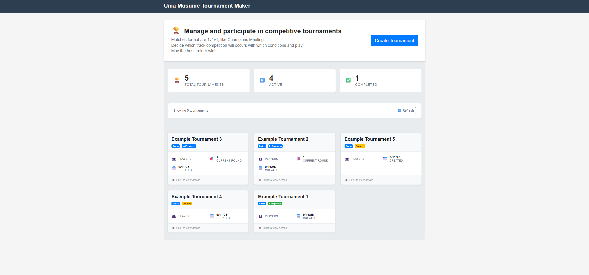
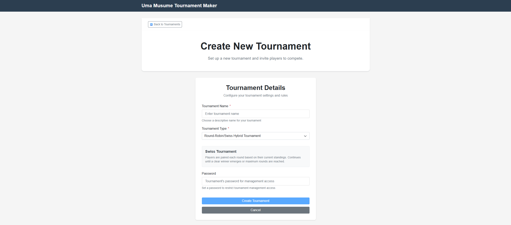
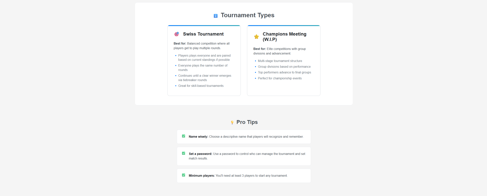
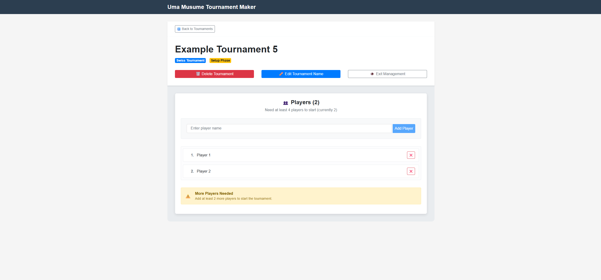
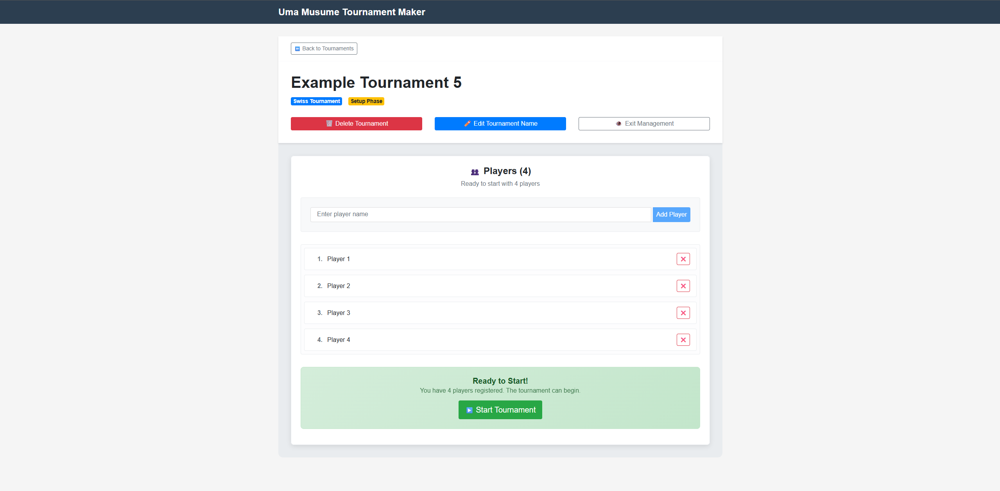
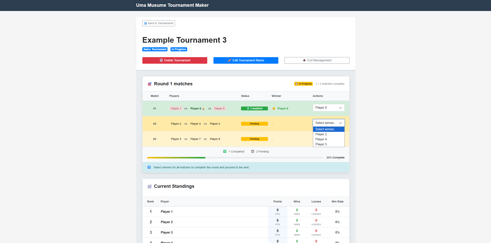

# Uma Musume Tournament Maker

A web application tournament maker for the game Uma Musume.

## Website link: https://umamusumetournamentmaker-599360421785.europe-west1.run.app

## 🎯 Main Features

The web application implements a **creative tournament format** that combines the best of Swiss and Round-Robin systems:

- **3-Player Simultaneous Matches** for dynamic competition
- **No Repeat Opponents Algorithm** ensuring fair play across all rounds
- **Swiss-Style Competitive Pairing** matching players of similar skill levels
- **Real-time Multi-user Management** with instant synchronization across all devices

## 📑 Table of Contents

- [🎮 Tournament System Features](#-tournament-system-features)
- [🎯 Usage Flow](#-usage-flow)
- [📷 Screenshots](#-screenshots)

## 🎮 Tournament System Features

### 🔄 Advanced Tournament Algorithm

The core innovation of this system is its **sophisticated Swiss-Round-Robin hybrid algorithm**:

### Tournament Types

#### Swiss-Round-Robin Tournament (Primary Format)

The system implements a **hybrid Swiss-Round-Robin system** optimized for 3-player matches:

**Core Mechanics:**

- **3-Player Matches**: Every match involves exactly 3 players with 3 Umas respectively competing simultaneously. Like matches in Champions Meeting.
- **No Repeat Opponents**: Advanced algorithm ensures no player faces the same opponents twice _(Dev Note: this need calibration, you may face the same opponents multiple times)_
- **Swiss-Style Pairing**: Players with similar performance levels are matched together _(Dev Note: this need calibration, this actually work but needs to be tone down. Competitive pairing should occurs when a play has played against most of the other players)_
- **Target-Based Progression**: Each player plays a predetermined number of matches based on tournament size:
  - 4 players → 3 matches each + eventual tiebrakers + final
  - 5-6 players → 4 matches each + eventual tiebrakers + final
  - 7-9 players → 5 matches each + eventual tiebrakers + final
  - 10-12 players → 6 matches each + eventual tiebrakers + final
  - 13+ players → Scales to max 8 matches + eventual tiebrakers + final

**Tournament Structure:**

- **Regular Rounds**: Players compete until reaching their target match count
- **Automatic Tiebreaker Rounds**: Generated when top 3 is not clear.
- **Final Championship**: Top 3 players compete in the climactic final match
- **Bye System**: For odd player counts, rotating [bye system](https://support.chess.com/en/articles/8706000-what-is-a-bye-in-a-tournament) with compensation points

**Scoring System:**

- **Win**: 1 points
- **Bye**: 1 points (compensation for sitting out)
- **Loss**: 0 points
- **Standings**: Ranked by Points → Wins → Losses → Player ID

#### Champions Meeting Tournament (In Development)

[Read here](https://gametora.com/umamusume/events/champions-meeting) (Gamatora.com) for the full explanation of the format.

This will be the next tournament format to be implemented.

### Core Functionality

- **Tournament Management**: Create, start, and manage tournaments with password protection
- **Player Management**: Add/delete players with real-time sync across all users
- **Match Management**: Set winners with immediate broadcast to all tournament viewers
- **Multi-user Support**: Multiple users can manage tournaments simultaneously
- **Real-time Updates**: Live synchronization via WebSockets for all tournament actions
- **Optimistic UI**: Immediate feedback with rollback on API failures
- **Responsive Design**: Works on desktop and mobile devices _(TODO: A good part of the UI is mobile compatible, but some functionnalities are broken in mobile mode. Depending on demand, I will fix it quickly. Or a contributor might do it.)_

## 🎯 Usage Flow

### Tournament Management Flow

#### Setup Phase

1. **Create Tournament**: Choose Swiss-Round-Robin format, set name and optional password
2. **Add Players**: Add participants (minimum 4, no maximum limit)
3. **Player Management**: Add/remove players with real-time sync across all users
4. **Start Tournament**: System generates first round with optimal 3-player matchups

#### Active Tournament Phase

1. **Round Execution**: Players compete in simultaneous 3-player matches
2. **Winner Selection**: Set match winners with immediate broadcast to all users
3. **Automatic Progression**: System tracks match completion and player statistics
4. **Smart Round Generation**:
   - Regular rounds until all players reach target matches
   - Automatic tiebreaker rounds if top 3 are tied
   - Final championship round with top 3 players

#### Multi-user Collaboration

- **Password Protection**: Secure tournament access for authorized users
- **Real-time Synchronization**: Instant updates across all connected devices
- **Concurrent Management**: Multiple users can manage tournament simultaneously
- **Live Progression**: All users advance to new rounds together automatically
- **Optimistic UI**: Immediate feedback with server validation and rollback on conflicts

#### Tournament Completion

- **Dynamic Standings**: Real-time leaderboard with Points → Wins → Losses ranking. Leaderboard is updated when the new round is created.
- **Final Results**: Championship match determines ultimate winner
- **Tournament History**: Complete match history and statistics preserved. _(Dev Note: Matches history UI not made for now)_

## 📷 Screenshots

## 📄 License

This project is licensed under the MIT License.

**Start your tournaments!** 🎯
